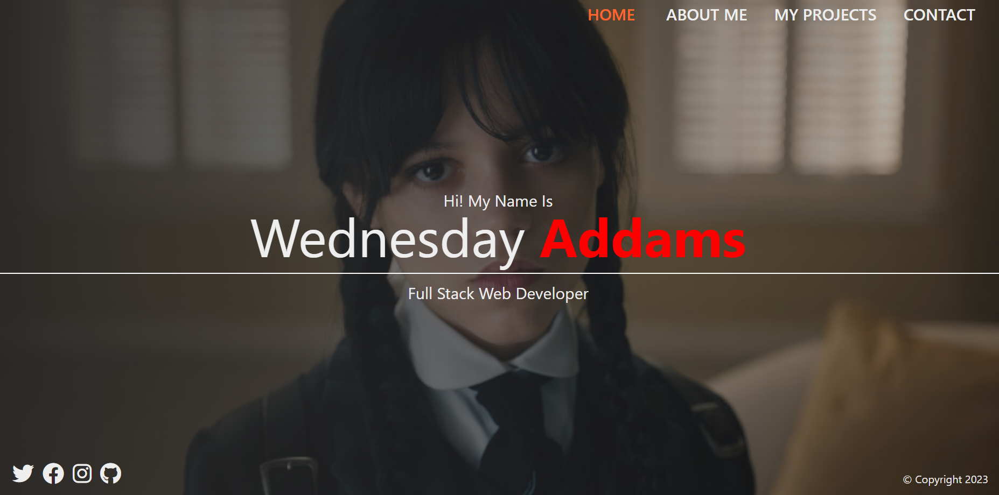

# React Sass Showcase

[Live Demo](https://showcase-react-sass.netlify.app/)
## Screenshots



This project is a React application showcasing the use of Sass for styling. It includes routing, responsive design, and a personal portfolio layout.

## Features

-   **Routing:** Uses React Router v7 for navigation between different pages.
-   **Sass Styling:** Demonstrates the use of Sass for modular and maintainable styling.
-   **Responsive Design:** Implements responsive design using Sass mixins and media queries.
-   **Portfolio Layout:** Presents a personal portfolio with sections for home, about, projects, and contact.
-   **Private Routing:** Includes a private route example to protect the contact page.
-   **Font Awesome Icons:** Utilizes Font Awesome for social media icons and contact information.

## Technologies Used

-   React 19.0.0
-   React DOM 19.0.0
-   React Router DOM 7.1.1
-   React Scripts 5.0.1
-   Sass 1.83.4
-   Font Awesome 6.2.1

## Getting Started

To run this project locally, follow these steps:

1.  **Clone the repository:**

    ```bash
    git clone <repository_url>
    ```

2.  **Navigate to the project directory:**

    ```bash
    cd react-sass-showcase
    ```

3.  **Install dependencies:**

    ```bash
    npm install
    ```

4.  **Start the development server:**

    ```bash
    npm start
    ```

    This will open the application in your default web browser.

## Project Structure
  ```
  react-sass-showcase/
├── public/
├── src/
│   ├── components/
│   │   ├── Footer/
│   │   │   ├── Footer.js
│   │   │   ├── Footer.scss
│   │   ├── Navbar/
│   │   │   ├── Navbar.js
│   │   │   ├── Navbar.scss
│   ├── helper/
│   │   ├── imageData.js
│   ├── pages/
│   │   ├── about/
│   │   │   ├── About.js
│   │   │   ├── About.scss
│   │   ├── contact/
│   │   │   ├── Contact.js
│   │   │   ├── Contact.scss
│   │   ├── home/
│   │   │   ├── Home.js
│   │   │   ├── Home.scss
│   │   ├── projects/
│   │   │   ├── Projects.js
│   │   │   ├── Projects.scss
│   ├── router/
│   │   ├── AppRouter.js
│   │   ├── PrivateRouter.js
│   ├── scss/
│   │   ├── mixins.scss
│   │   ├── reset.scss
│   │   ├── variables.scss
│   ├── App.js
│   ├── App.scss
│   ├── index.js
│   ├── index.css
├── package.json
├── package-lock.json
└── README.md
    ```

-   `src/components`: Contains reusable React components.
    -   `Footer`: Displays the footer section with social icons and copyright.
    -   `Navbar`: Displays the navigation bar with links to different pages.
-   `src/helper`: Contains helper files like `imageData.js` for project images.
-   `src/pages`: Contains React components for each page.
    -   `about`: Displays information about the person.
    -   `contact`: Displays contact information. (Protected by PrivateRouter)
    -   `home`: Displays the home page with a welcome message.
    -   `projects`: Displays a grid of project images.
-   `src/router`: Contains routing components.
    -   `AppRouter`: Manages the application's routing.
    -   `PrivateRouter`: Protects routes that require authentication.
-   `src/scss`: Contains Sass files for styling.
    -   `mixins.scss`: Reusable Sass mixins.
    -   `reset.scss`: CSS reset styles.
    -   `variables.scss`: Sass variables for colors, fonts, etc.
-   `App.js`: The main application component.
-   `App.scss`: Global styles for the application.
-   `index.js`: Entry point of the application.
-   `index.css`: Global CSS styles.
-   `package.json`: Manages project dependencies and scripts.

## Sass Structure

The Sass structure is organized to promote modularity and maintainability.

-   `reset.scss`: Resets default browser styles.
-   `variables.scss`: Defines variables for colors, fonts, and other reusable values.
-   `mixins.scss`: Contains reusable Sass mixins for media queries, background images, etc.
-   Component-specific `.scss` files are located alongside their respective `.js` files.

## Routing

The application uses React Router for navigation.

-   `AppRouter.js` defines the routes for the application.
-   `PrivateRouter.js` is used to protect the contact page, simulating authentication.

## Responsive Design

The application implements responsive design using Sass media queries and mixins.

-   Media queries are defined in `mixins.scss` and used throughout the application.
-   The layout adjusts based on screen size to provide an optimal user experience.

## Usage

-   Navigate through the pages using the navigation bar.
-   View project images on the projects page.
-   Access contact information on the contact page (requires authentication).

## Contributing

Contributions are welcome! If you find a bug or have an idea for a new feature, please open an issue or submit a pull request.

## License

This project is licensed under the MIT License.